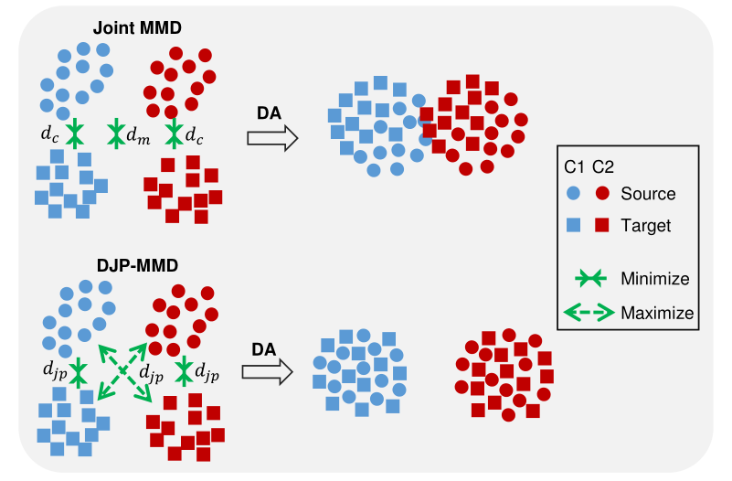
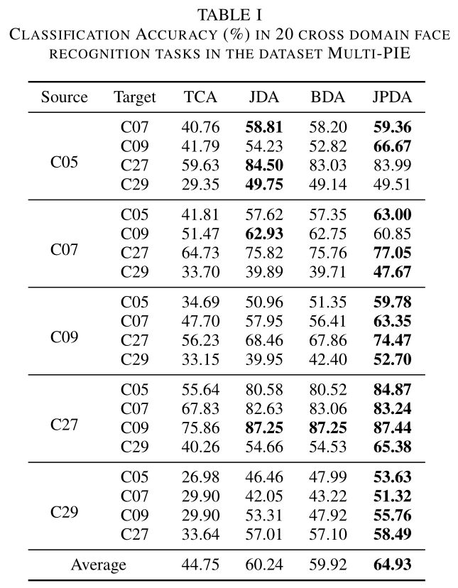

## Joint Probability Distribution Adaptation (JPDA)

This repository contains codes of a simple but efficient **discriminative joint probability MMD (DJP-MMD)** for domain adaptation. We verified its performance by embedding it to a joint probability domain adaptation (JPDA) framework. The figure below shows the difference between the DJP-MMD and joint MMD. More details see [PaperWeekly](https://blog.csdn.net/c9Yv2cf9I06K2A9E/article/details/105001976)

<div align="center">
    
</div>

Compared with traditional MMD approaches, JPDA has a simpler form, and is more effective in measuring the discrepancy between different domains. Experiments on six image classification datasets verified the effectiveness of JPDA. 

<div align="center">
    
</div>

The average accuracies on the Multi-PIE dataset are shown in Table 1. JPDA outperforms all the joint MMD based approaches in most tasks, and achieve an accuracy improvement of **4.69%** compared with JDA.

## Running the code

The code is MATLAB code works in Windows 10 system.

Code files introduction:

**demo_classify_office.m** -- demo file, JPDA on 12 cross-domain image classification tasks on dataset Office+Caltech.

**demo_classify_other.m** -- demo file, joint probability distribution adaptation (JPDA) over 4 cross-domain image classification tasks on datasets COIL, USPS and MNIST.

**demo_classify_pie.m** -- demo file, JPDA on 20 cross-domain image classification tasks on dataset Multi-PIE.

**JPDA.m** -- function file, it's the implementation of JPDA approach. Please find the specific input/output instructions in the function comments.

## Citation

This code is corresponding to our IJCNN 2020 paper below:

```
@Inproceedings{wenz20djpmmd,
  title={Discriminative Joint Probability Maximum Mean Discrepancy (DJP-MMD) for Domain Adaptation},
  author={Wen, Zhang and Dongrui Wu},
  booktitle={Proc. Int'l Joint Conf. on Neural Networks},
  year={2020},
  month=jul,
  pages={1--8},
  address={Glasgow, UK}
}
```

Please cite our paper if you like or use our work for your research, thank you very much!

## Supplementary

In the toy experiments in our paper, we verified the effectiveness of DJP-MMD by embedding it to the JDA framework (a regularization term and a principal component preservation constraint) for simplicity, and the results were indeed significantly better than the joint or balanced MMD.

In our later experiments (use DJP-MMD in TJM or JGSA etc.), we found that a more robust metric to measure the discrepancy may be the GFK or CORAL preprocessed data with DJP-MMD.

**Recently, we test the proposed DJP-MMD in Domain Adaptive Neural Networks (DaNN)**, and this new metric shows better convergence speed and accuracy, please refer to the pytorch version in [DaNN_DJP](https://github.com/chamwen/DaNN_DJP)